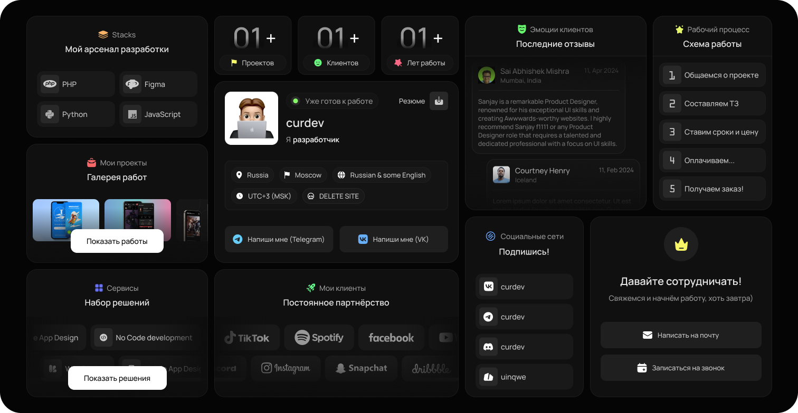

# Портфолио разработчика CurDev

  

*Добро пожаловать в портфолио! Это место, где демонстрируются навыки, проекты и творческий подход к веб-разработке.*

## О проекте

Этот веб-сайт — персональное портфолио, созданное для представления навыков и работ в области веб-разработки. Он разработан с нуля с использованием современных технологий и минималистичного дизайна, чтобы подчеркнуть содержание и удобство использования.

- **Название:** Портфолио CurDev
- **Разработчик:** ItsDarkEz
- **Цель:** Демонстрация проектов, навыков и профессионального опыта

---

## Технологии

Сайт построен с использованием следующих инструментов и технологий:

- **HTML** — структура и семантика
- **CSS** — стилизация и адаптивный дизайн
- **jQuery** — интерактивность и динамические элементы
- **Шрифт Manrope** — современная и стильная типографика
---

## Особенности

- **Адаптивный дизайн** — сайт отлично выглядит на устройствах любого размера
- **Интерактивные элементы** — плавные анимации и удобная навигация
- **Слайдер проектов** — карусель из проектов, решений реализованное на чистом CSS
- **Чистый код** — структурированный и оптимизированный для быстрой загрузки
- **Стильная типографика** — использование шрифта Manrope для элегантного оформления текста

---
